# DenseNet-169 — Crop Disease Detection: All Outputs

Every chart, confusion matrix, and Grad-CAM visualization generated across all four benchmark runs, organized by dataset.

Notebook: [kaggle.com/code/taranyasaravanan/densenet-169-crop-disease-dectection](https://www.kaggle.com/code/taranyasaravanan/densenet-169-crop-disease-dectection)

> **Heads-up before you publish:** matching the class names actually printed inside these plots to your results table, the PlantDoc and emmarex/plantdisease rows for DenseNet look swapped from what's in your tracking sheet — the plot with Pepper/Potato/Tomato classes (i.e. emmarex) scores ~99.6%, while the plot with the "train"/"test" labeling bug (which matched PlantDoc in the ResNet notebook) scores ~90.2%. Your table currently lists PlantDoc at 99.64% and emmarex at 90.21%. Worth double-checking against the notebook before publishing — the sections below are labeled by what the images themselves show.

---

## PlantDoc (nirmalsankalana) — ~90.2% test accuracy (per the image; sheet lists 99.64%/99.65% — see note above)

### Sample training images
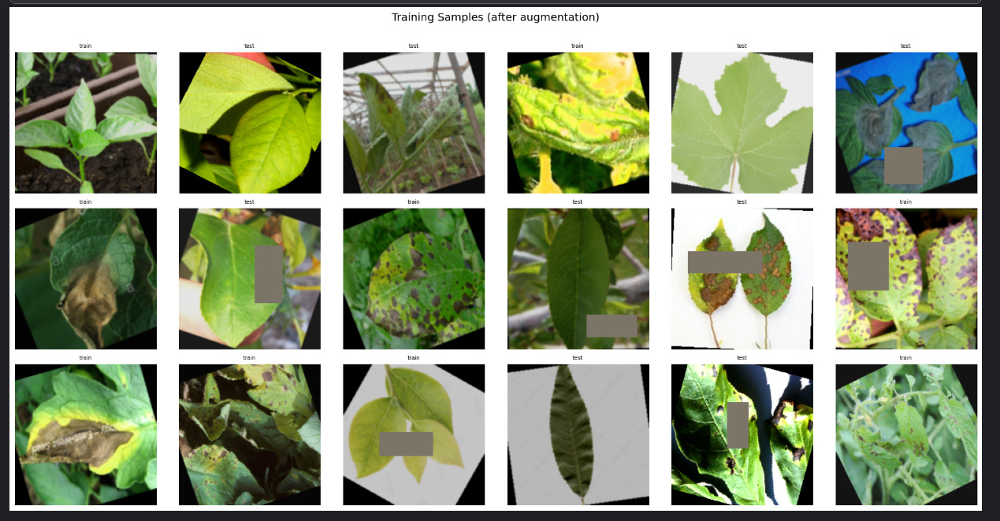
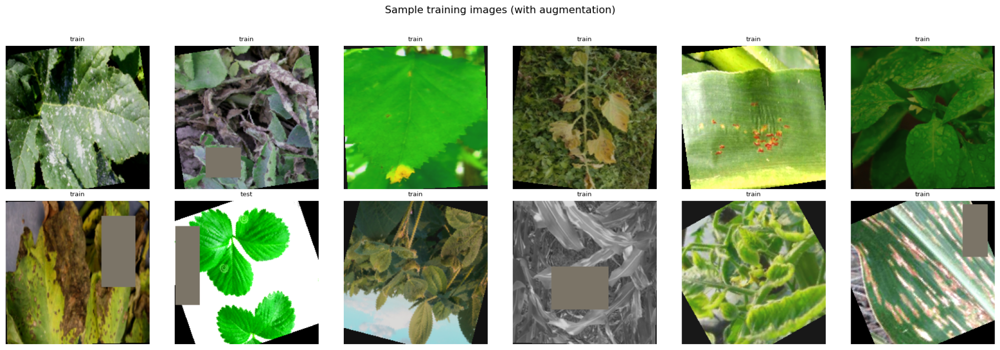

### Training curve
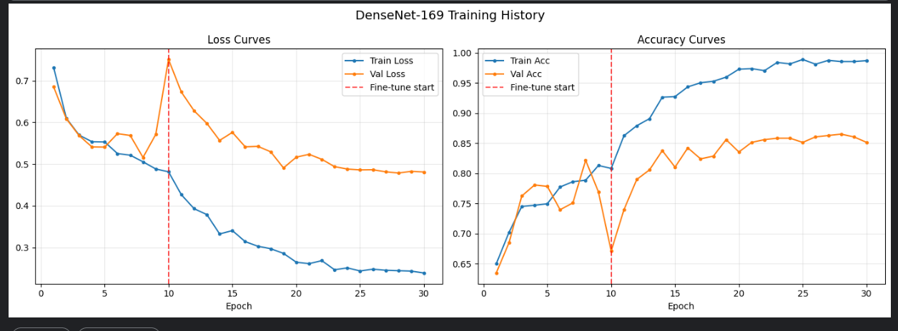
*Validation accuracy plateaus around 85–87%, consistent with a final test accuracy near 90%.*

### Confusion matrix
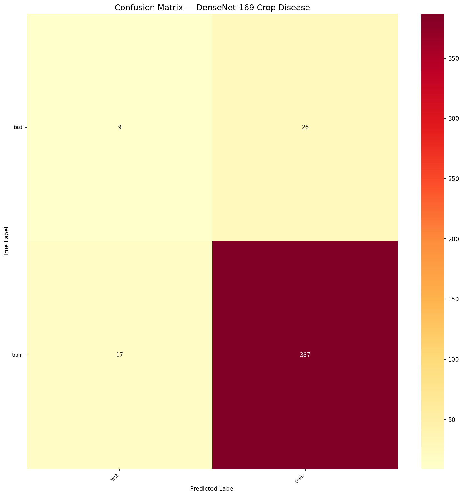
*Classes read as "train"/"test" rather than disease names — the same folder-labeling artifact seen in the ResNet-50 PlantDoc run.*

### Per-class accuracy
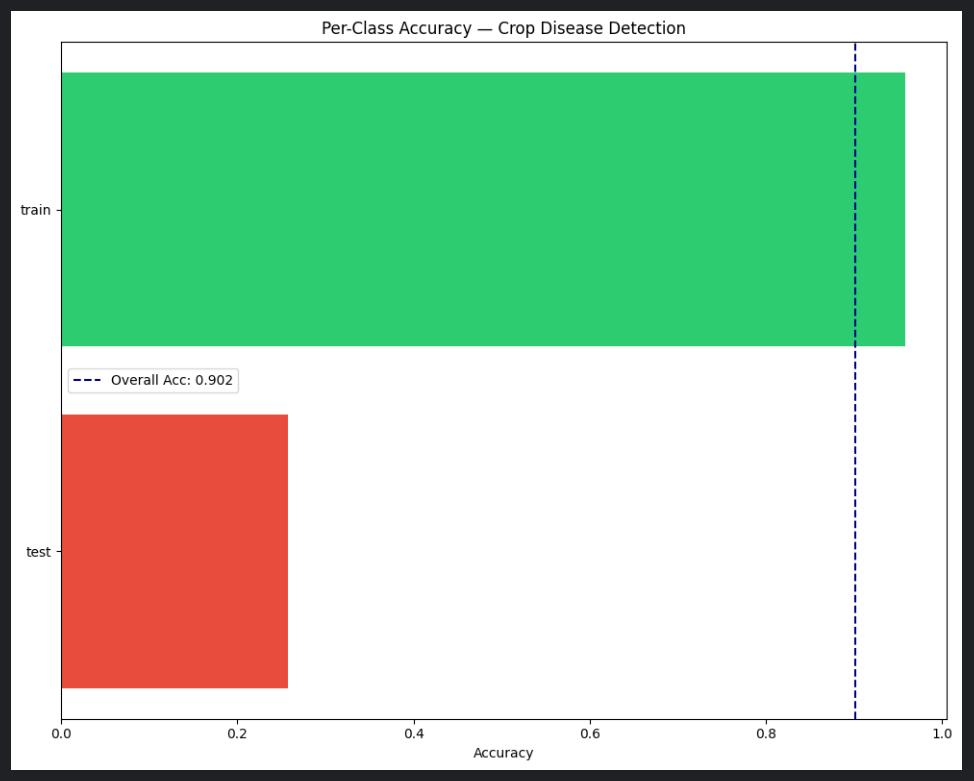
*Overall Acc: 0.902*

---

## PlantVillage — Pepper/Potato/Tomato subset (emmarex/plantdisease) — ~99.6% test accuracy (per the image; sheet lists 90.21%/89.54% — see note above)

### Training curve
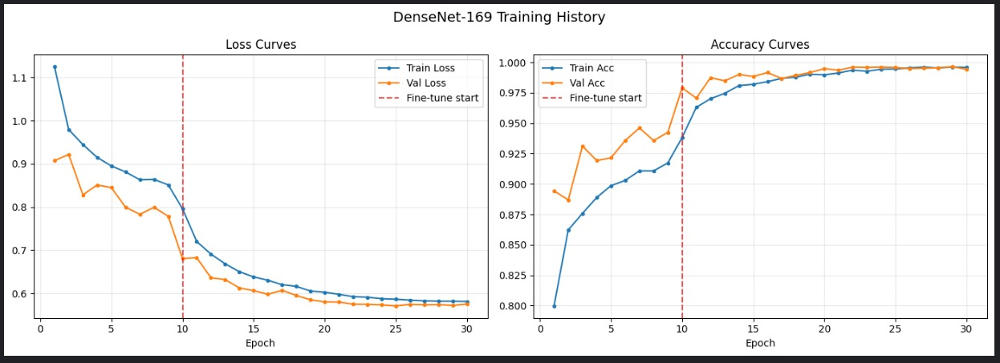

### Confusion matrix
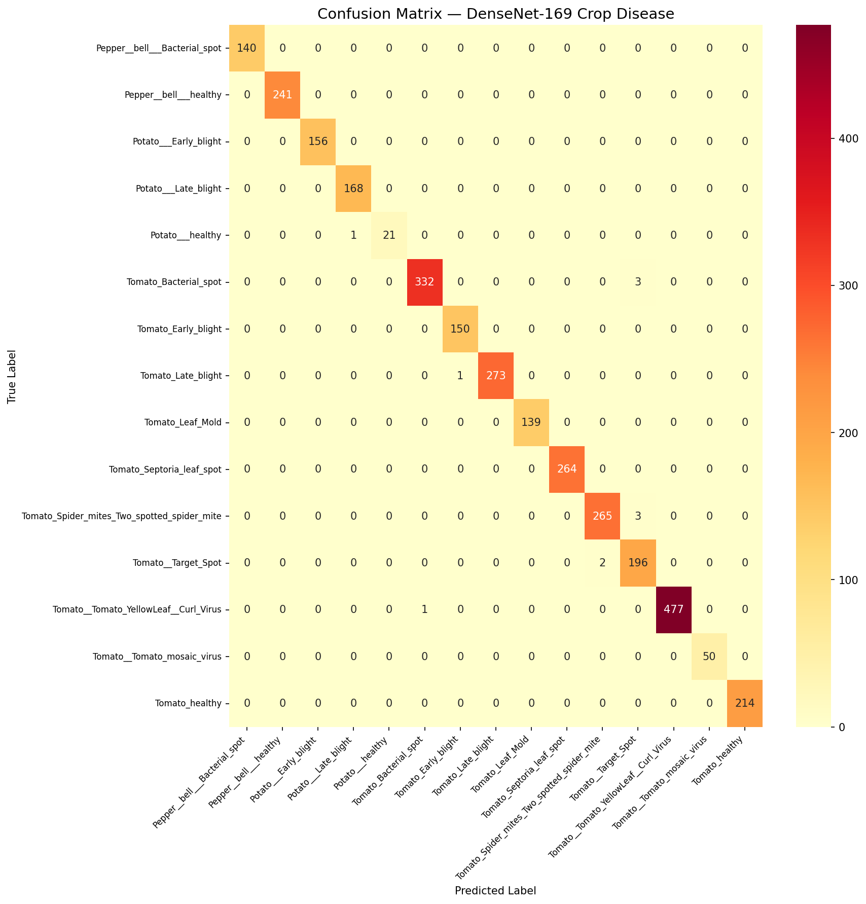

### Per-class accuracy
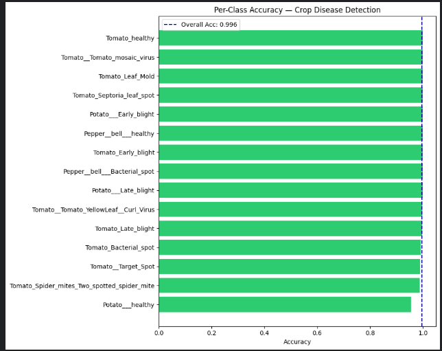
*Overall Acc: 0.996*

---

## PlantVillage Dataset (abdallahalidev) — Accuracy 99.72% / F1 99.59%

### Confusion matrix
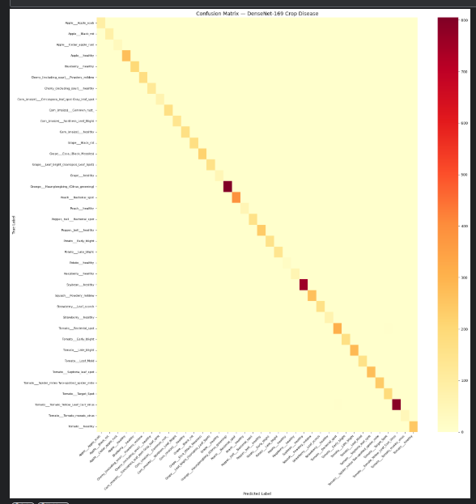

### Grad-CAM — model attention
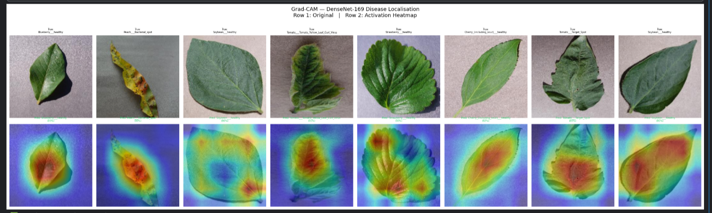

### Per-class accuracy
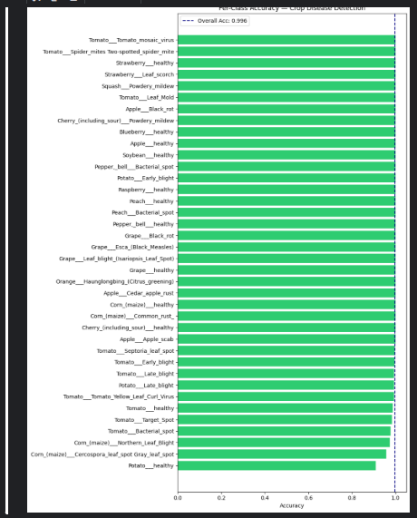

---

## New Plant Diseases Dataset (vipoooool) — Accuracy 99.81% / F1 99.81%

### Sample training images
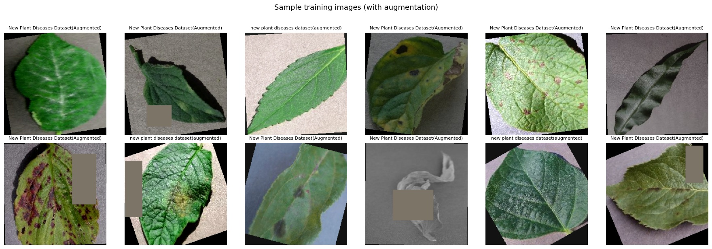

### Training curve
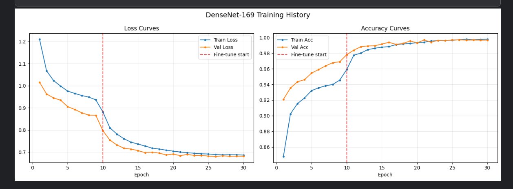

### Confusion matrix
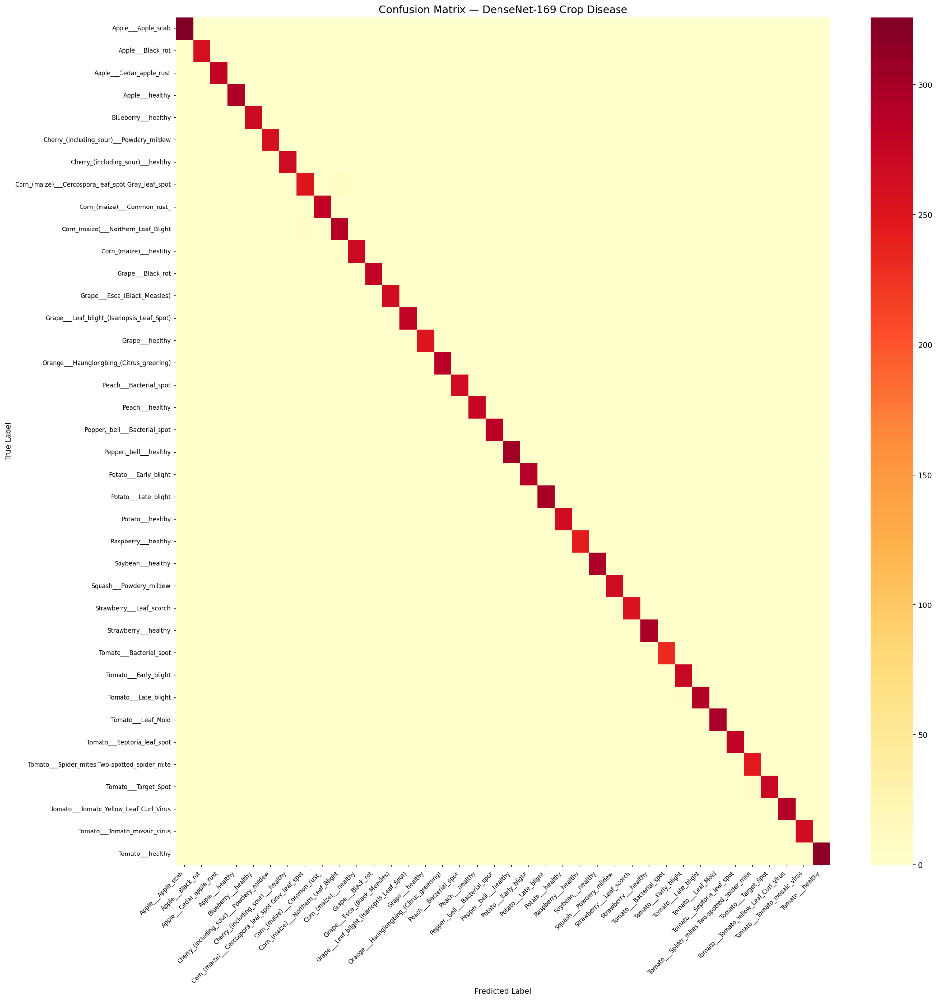

### Per-class accuracy
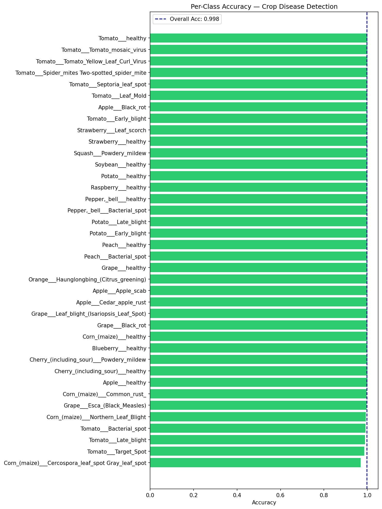

---

## Other sample-image previews from the notebook

> These preview grids also appear in the notebook but don't carry a dataset label or accuracy figure, so they aren't confidently attributed to one section above.

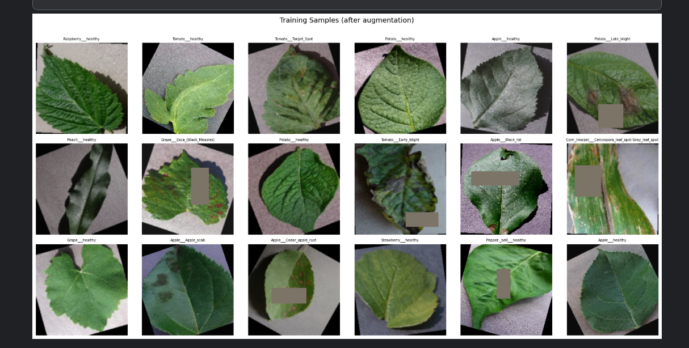
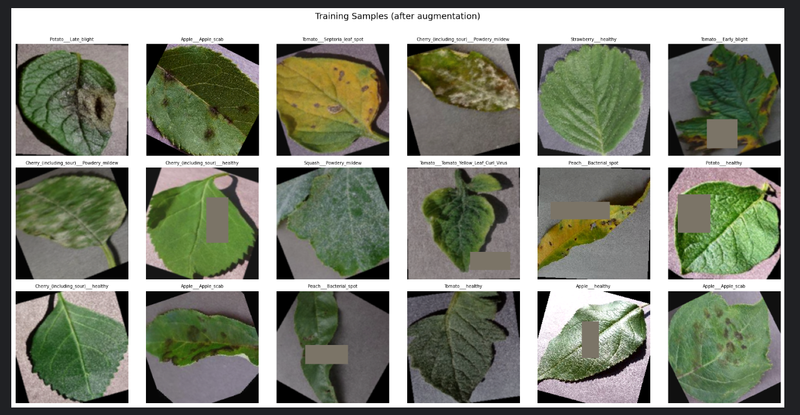
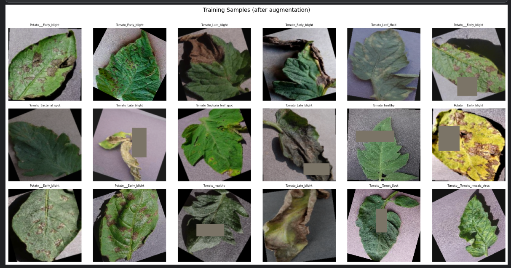
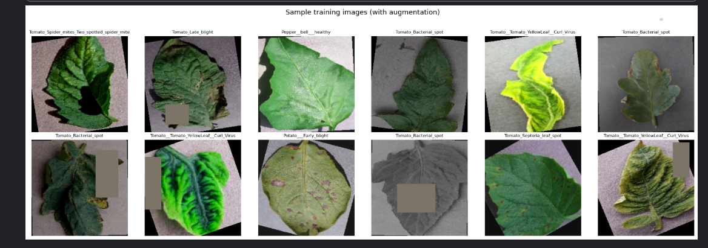
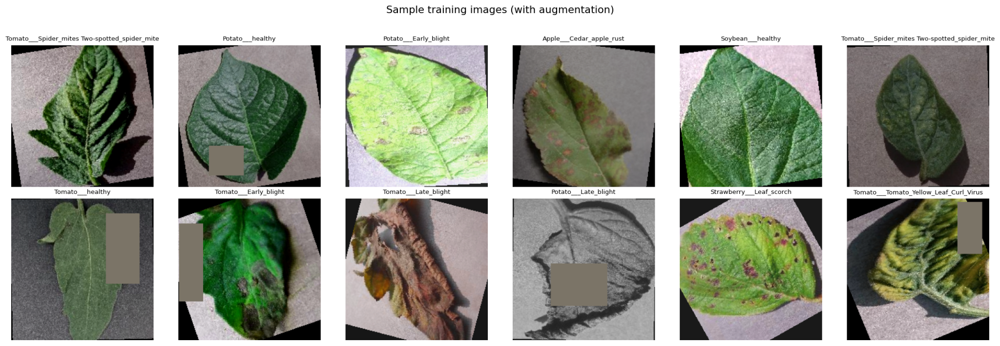
